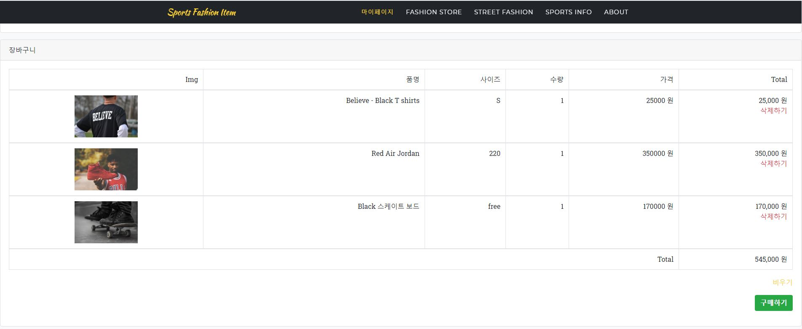

* * *
# SFI - 인터넷 쇼핑몰 

[제작기간] 4주     
[프로젝트 내용] 쇼핑몰 웹사이트 구현    
[프로젝트 인원] 1명    

웹사이트 : <http://115.68.221.104/SFI/WebContent/Resources/index.php>    
소스코드 : <https://github.com/ll0301/SFI/tree/master/WebContent/Resources>    
시연영상 : <http://115.68.221.104/SFI/WebContent/Resources/info.php#info>    
블로그 : <https://jroomstudio.tistory.com/>    
Email : <wanted0301@gmail.com>    
* * *
### SKILL
  > #### Back-end    
  >  * Apache2  
  >  * PHP  
  > #### Database   
  >  * Mysql(MariaDB)
  > #### Front-end    
  >  * Bootstrap  
  >  * Javascript  
  >  * Jquery
  >  * HTML/CSS
  > #### ETC    
  >  * Ubuntu  
  >  * PHPMyAdmin  
  >  * Iwinv  
* * *
### 페이지 세부 기능 
  > ### 회원가입 
  > 
  > * Email 중복체크    
  > * MD5 비밀번호 암호화    
  > * HTTP - GET, POST 통신    
  > * * *
  > ### 로그인 
  > 
  > * Cookie -> 아이디 저장
  > * HTTP - GET, POST 통신
  > * 관리자, 게스트, 회원으로 구분 
  > * SESSION 로그인 구현 
  > * * *
  > ### 메인 페이지
  > 
  > * 관리페이지(admin) / 마이페이지(guest,member)    
  > * 스토어    
  > * 스냅사진    
  > * INFO      
  > * about    
  > * * * 
  > ### 관리자 페이지 - 상품관리 
  > 
  > * 상품별 추가, 수정, 삭제 구현    
  > * mariaDB 데이터 저장    
  > * 페이징 처리    
  > * * *
  > ### 관리자 페이지 - 회원관리
  > 
  > * 회원 리스트 확인    
  > * * *
  > ### 관리자 페이지 - 스냅사진 관리
  > 
  > * 스냅사진 추가, 수정, 삭제 구현    
  > * mariaDB 데이터 저장    
  > * 페이징 처리    
  > * * *
  > ### 관리자 페이지 - 구매요청 목록 
  > 
  > * 출고관리    
  > * 구매요청 상세정보 확인    
  > * mariaDB 데이터 저장    
  > * 페이징 처리 
  > * * *
  > ### 관리자 페이지 - 문의사항 목록 
  > 
  > * 댓글에 답변하기 구현 
  > * 답변 추가, 수정, 삭제 구현 
  > * mariaDB 데이터 저장    
  > * 페이징 처리 
  > * * *
  > ### 스토어 
  > 
  > * wear, shoes, acc 구분    
  > * 베너광고변경(admin)    
  > * 아이템별 페이징 처리    
  > * * *
  > ### 스토어 디테일 
  > 
  > * 관리자, 회원, 게스트 구분 
  > * 관리자는 열람만 가능 
  > * 장바구니 추가 (회원, 게스트)
  > * 문의하기 기능 (회원)
  > * * *
  > ### 스트릿 스냅사진 , 디테일 
  > 
  > 
  > * 페이징 처리 
  > * * *
  > ### 마이페이지 장바구니
  > 
  > * Cookie 를 활요한 장바구니 구현    
  > * 추가, 삭제, 전체삭제    
  > * * *
  > ### 마이페이지 나의문의하기 목록 
  >   
  > * 삭제 
  > * * *
  > ### 마이페이지 구매하기
  >  
  > * 카카오톡 결제 
  > * * *
  > ### 마이페이지 결제완료 목록
  > 
  > 
  > * 배송정보 확인
  > * * *
